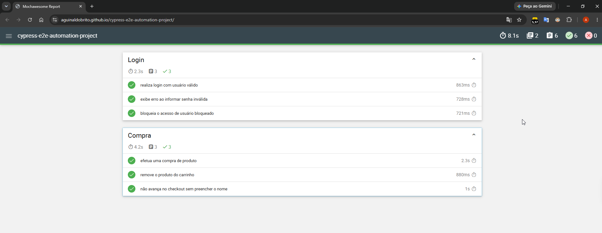

# Cypress E2E Automation

Testes end-to-end com **Cypress** no [Sauce Demo](https://www.saucedemo.com),
cobrindo login e o fluxo de compra, com pipeline de **CI/CD no GitHub Actions**
e relatório HTML publicado no GitHub Pages.

📊 **Relatório da última execução:** https://aguinaldobrito.github.io/cypress-e2e-automation-project/



## Tecnologias

- Cypress 15
- Mochawesome (relatório HTML)
- GitHub Actions + GitHub Pages
- Node.js 22

## Cenários cobertos

**Login** (`cypress/e2e/login.cy.js`)
- Login com usuário válido
- Erro ao informar senha inválida
- Bloqueio de usuário bloqueado

**Compra** (`cypress/e2e/compra.cy.js`)
- Fluxo completo: escolher produto, carrinho, checkout e confirmação do pedido
  (conferindo nome e preço do produto no resumo)
- Remover produto do carrinho
- Validação de campo obrigatório no checkout

## Estrutura do projeto

```
cypress-e2e-automation-project/
├── .github/workflows/
│   └── cypress-tests.yml        # pipeline CI/CD
├── cypress/
│   ├── e2e/                     # specs
│   │   ├── login.cy.js
│   │   └── compra.cy.js
│   ├── fixtures/                # massa de dados
│   │   ├── usuarios.json
│   │   └── cliente.json
│   └── support/
│       ├── commands.js          # comandos customizados (cy.login)
│       └── e2e.js
├── cypress.config.js            # configuração do Cypress e do reporter
├── package.json
└── README.md
```

O comando customizado cy.login() faz o login pela interface e deixa o teste já na página de produtos, pronto para o cenário seguinte.

## Pré-requisitos

- Node.js 20 ou superior (pipeline usa o 22)

## Instalação

```bash
npm install
```

## Execução

Abrir a interface interativa do Cypress:

```bash
npm run cy:open
```

Rodar em modo headless e gerar o relatório HTML em `report/index.html`:

```bash
npm run test:report
```

Apenas rodar os testes, sem relatório:

```bash
npm run cy:run
```

## CI/CD

O workflow `.github/workflows/cypress-tests.yml` roda a cada push e pull request
na `main` (e também manualmente). Ele instala as dependências, executa os testes
em modo headless no Chrome, gera o relatório HTML, guarda relatório e screenshots
de falha como artefatos e publica o relatório no GitHub Pages.

## Histórico

Este projeto foi originalmente escrito com Cypress 5.6 contra um site
que saiu do ar. Foi reescrito em Cypress 15, com nova estrutura (`cypress.config.js`,
`cypress/e2e`), novo site de teste e pipeline de CI/CD. A versão original está
preservada na branch `legacy-2021`.
